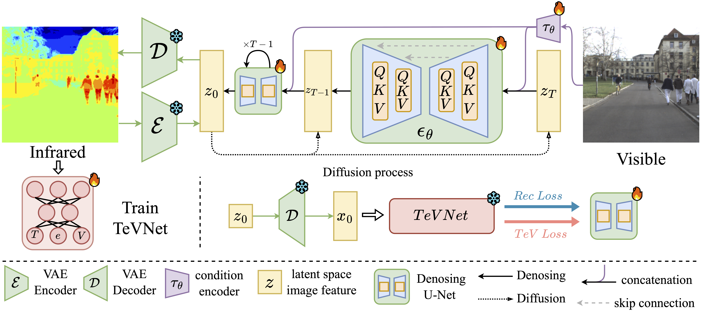

# DIR
This is anonymous code for DIR. Now, we only release the infrence code. We will release the whole training code as soon as the paper is accepted.



## Dependencies

We recommend that setup the environment with `environment.yaml` with conda.

## Dataset

You can download the Freiburg dataset [here](http://thermal.cs.uni-freiburg.de/).

You can download the KAIST dataset [here](https://soonminhwang.github.io/rgbt-ped-detection/).

Please download the dataset and modify the cooresponding input `indir` in `run_test_xx.sh`. The size of whole dataset is large, we place some test images in `dataset` dictionary, you can use them.

## Pretrained weights

| Pretrained weights |                             Link                             | Dataset  |    explanation    |
| :----------------: | :----------------------------------------------------------: | :------: | :---------------: |
|     DIR $\dag$     | [Freiburg_tev.zip](https://drive.google.com/file/d/17HNv8m5FzmckWWu37iFKPrFBpARv3dbY/view?usp=sharing) | Freiburg | For IR generation |
|     DIR $\dag$     | [Kaist_tev.zip](https://drive.google.com/file/d/1n-cezecqLcADfFnxwFQ18zk7obEj2mCc/view?usp=sharing) |  KAIST   | For IR generation |
|      VQGANf4       | [vqf4](https://ommer-lab.com/files/latent-diffusion/vq-f4.zip) |    /     |  Trained by LDM   |

## Evaluation

You can run the shell scripts to evaluate.

```sh
bash shell/run_test_kaist.sh
```

```sh
bash shell/run_test_freiburg.sh
```

## Acknowledgement

Our code is built upon [LDM](https://github.com/CompVis/latent-diffusion). We thank the authors for their excellent work.
